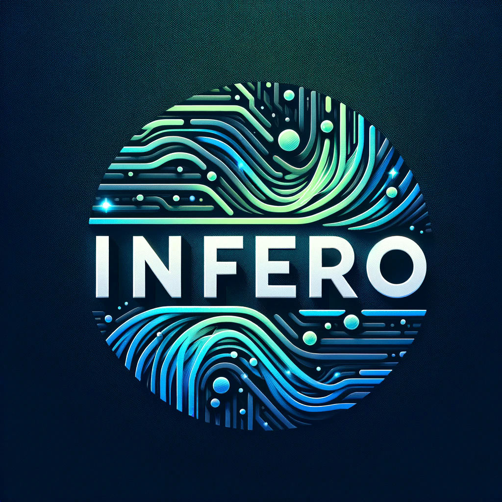

[](https://discord.gg/tPWjMwK) [](https://twitter.com/tinyBigGAMES)
# Infero
###  Overview
A streamlined and user-friendly library designed for performing local LLM inference directly through your preferred programming language. This library efficiently loads LLMs in [GGUF format](https://huggingface.co/docs/hub/gguf) into CPU or GPU memory, utilizing a [CUDA backend](https://blogs.nvidia.com/blog/what-is-cuda-2/) for enhanced processing speed.

###  Installation
- Download [Infero](https://github.com/tinyBigGAMES/Infero/archive/refs/heads/main.zip) and extract it to your preferred location.
- Acquire a GGUF model from Hugging Face, ensuring compatibility with [llama.cpp](https://github.com/ggerganov/llama.cpp). Reference the [MODELS.txt](docs/MODELS.txt) for supported models.
- The application utilizes CUDA for enhanced performance on supported GPUs. In the absence of a CUDA-enabled GPU, computation defaults to the CPU. Ensure the model size does not exceed the available system resources, considering the requisite memory.
- Consult the `installdir\examples` directory for demonstrations on integrating **Infero** with your programming language.
- Include the following DLLs in your project distribution: `cublas64_12.dll`, `cublasLt64_12.dll`, `cudart64_12.dll`, `llama.dll`, and `Infero.dll`.
- Infero API supports integration across programming languages that accommodate Win64 and Unicode, with out-of-the-box support for Pascal (Delphi/FreePascal) and C/C++ (C++Builder, Visual Studio 2022).
- Ship-ready DLLs are included in the repository; however, if there is a need to rebuild the `Infero.dll`, Delphi 12.1 is required.
- This project is developed using RAD Studio 12.1, on Windows 11, powered by an Intel Core i5-12400F at 2500 MHz with 6 cores (12 logical), equipped with 36GB RAM and an NVIDIA RTX 3060 GPU with 12GB RAM.

- We encourage testing and welcome pull requests.
- If you find this project beneficial, please consider starring the repository, sponsoring, or promoting it. Your support is invaluable and highly appreciated.
 
###  Examples  
Delphi example:
```Delphi   
uses
  System.SysUtils,
  Infero;

begin
  // init
  if not Infero_Init('config.json', nil) then
    Exit;
  try
    // add message
    Infero_AddMessage(ROLE_SYSTEM, 'You are a helpful AI assistant');
    Infero_AddMessage(ROLE_USER, 'What is AI?');
    
    // do inference
    if Infero_Inference('phi3', 1024, nil, nil, nil) then
    begin
      // success
    end
  else
    begin
      // error
    end;
  finally
    Infero_Quit();
  end;
end.
```  
C/CPP Example  
```CPP  
#include <Infero.h>

int main()
{
    // init config
    Infero_InitConfig("config.json", nil);

    // add message
    Infero_AddMessage(ROLE_SYSTEM, "You are a helpful AI assistant");
    Infero_AddMessage(ROLE_USER, "What is AI?");

    // do inference
    if (Infero_Inference("phi34", 1024, NULL, NULL, NULL)
    {
        // success
    }
    else
    {
        // error
        return 1;
    };
    
    Infero_Quit();

    return 0;
}
```

###  Media

https://github.com/tinyBigGAMES/Infero/assets/69952438/95e9eb92-8a12-48bc-9d08-fa3585f2e9eb

https://github.com/tinyBigGAMES/Infero/assets/69952438/0570fd68-4af9-4c92-8868-42fb89724776

###  Support
Our development motto: 
- We will not release products that are buggy, incomplete, adding new features over not fixing underlying issues.
- We will strive to fix issues found with our products in a timely manner.
- We will maintain an attitude of quality over quantity for our products.
- We will establish a great rapport with users/customers, with communication, transparency and respect, always encouragingng feedback to help shape the direction of our products.
- We will be decent, fair, remain humble and committed to the craft.

###  Links
- <a href="https://github.com/tinyBigGAMES/Infero/issues" target="_blank">Issues</a>
- <a href="https://github.com/tinyBigGAMES/Infero/discussions" target="_blank">Discussions</a>
- <a href="https://discord.gg/tPWjMwK" target="_blank">Discord</a>
- <a href="https://youtube.com/tinyBigGAMES" target="_blank">YouTube</a>
- <a href="https://twitter.com/tinyBigGAMES" target="_blank">X (Twitter)</a>
- <a href="https://tinybiggames.com/" target="_blank">tinyBigGAMES</a>


###  License
Infero is a community-driven project created by <a href="https://github.com/tinyBigGAMES" target="_blank">tinyBigGAMES LLC</a>.

BSD-3-Clause license - Core developers:
- <a href="https://github.com/jarroddavis68" target="_blank">Jarrod Davis</a>

###  Acknowledgments
Infero couldn't have been built without the help of wonderful people and great software already available from the community. **Thank you!**

Software
- [llama.cpp](https://github.com/ggerganov/llama.cpp). 

People
- John Claw
- Robert Jalarvo


